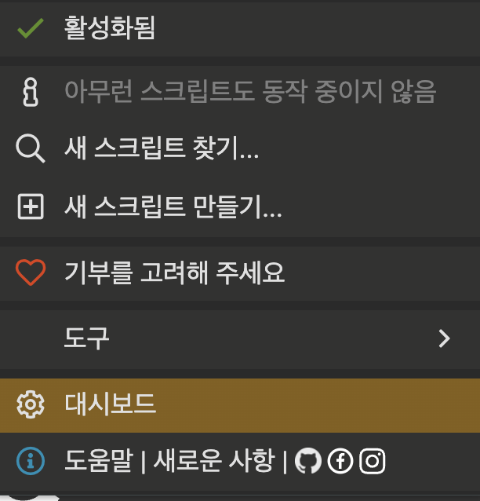

# nina-calc

버츄얼 헤르츠 도네 감사인사용으로 만들어진 팬 제작 Tampermonkey 스크립트입니다.

## 설치 및 사용방법
1. [여기](https://chromewebstore.google.com/detail/tampermonkey/dhdgffkkebhmkfjojejmpbldmpobfkfo)에 들어가서 [Tampermonkey](https://chromewebstore.google.com/detail/tampermonkey/dhdgffkkebhmkfjojejmpbldmpobfkfo) 크롬 확장프로그램을 설치합니다.  
2. tampermonkey 대시보드에 들어갑니다   
3. 설정에 들어가 설정모드를 중급자로 바꿔줍니다.   
4. 쭉 내린뒤 다운로드 BETA 아래부분에 .xlsx를 추가합니다.   
5. [여기](https://github.com/sucat0/nina-calc/raw/main/dist/nina-calc.user.js)를 눌러 스크립트를 추가합니다.  
6. 스크립트를 추가한 뒤에는 [아프리카 도우미](http://afreehp.kr/setup/alertlist), [아프리카 별풍선](https://point.afreecatv.com/Balloon/AfreecaNormalExchange.asp)에서 **F10**을 눌러 메뉴를 열 수 있습니다.  
7. [아프리카 별풍선](https://point.afreecatv.com/Balloon/AfreecaNormalExchange.asp)에서 스크립트를 사용하다가 이런 화면이 뜨면 도메인 항상 허용 눌러주세요!   

## 수동 업데이트 방법
1. tampermonkey 대시보드에 들어갑니다   
2. nina-calc를 누릅니다   
3. 설정을 누릅니다   
4. 유저 스크립트 업데이트 확인을 누릅니다   

## 기능
- **[아프리카 도우미](http://afreehp.kr/setup/alertlist) 데이터 가져오기**
- **[아프리카 별풍선](https://point.afreecatv.com/Balloon/AfreecaNormalExchange.asp) 데이터 가져오기**
- **xlsx(엑셀) 파일로 데이터 저장**
- **아프리카 도우미, 별풍선 데이터 병합** (아프리카 도우미 200개 제한 넘었을 경우 사용)

#### and i also 니나 조아
